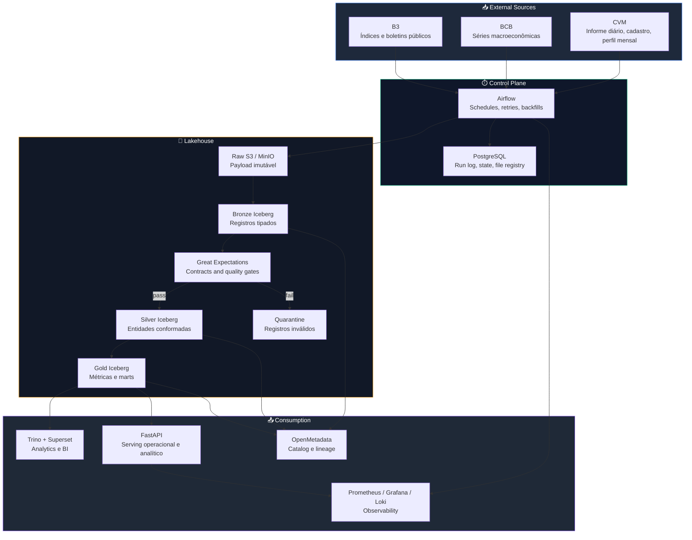

<div align="center">

# 🏦 Apex Lakehouse

### Transforma dados públicos de fundos no Brasil em produtos de dados confiáveis para analytics, API e governança

[](#-open-code-context) [](https://www.python.org/) [](https://airflow.apache.org/) [](https://iceberg.apache.org/) [](https://spark.apache.org/) [](https://trino.io/) [](https://kubernetes.io/)

*Unifica CVM, BCB e B3 em um lakehouse production-first com contratos, quality gates, lineage e serving por API e BI.*

</div>

---

## 📣 Open-Code Context

> Este repositório é a versão pública e open-code de uma plataforma originalmente concebida e desenvolvida pelo autor no contexto da **OCTIN**. A implementação publicada aqui foi reconstruída **fora dos servidores da OCTIN** e **não inclui** código proprietário, credenciais, infraestrutura interna, automações privadas ou datasets não públicos da empresa.
>
> A origem deste projeto remonta a **janeiro de 2024**. A versão publicada neste repositório representa uma **atualização e reconstrução** dessa iniciativa original em um novo contexto de código aberto, com reorganização da arquitetura, documentação e estrutura de entrega.

---

## 💡 Value Proposition

Dados públicos de fundos no Brasil existem em abundância, mas chegam fragmentados, com cadências diferentes, formatos heterogêneos e pouca rastreabilidade operacional. O resultado costuma ser reconciliação manual, métricas frágeis e consumo analítico pouco confiável.

**Apex Lakehouse** resolve isso com:

| Sem Este Sistema | Com Este Sistema |
|---|---|
| CSVs, ZIPs e APIs consumidos de forma isolada | Ingestão incremental unificada de CVM, BCB e B3 com um único control-plane |
| Métricas analíticas sem rastreio até a origem | Raw imutável, file hash, lineage e contracts do dataset até a métrica |
| Falha de qualidade contamina relatório ou quebra o fluxo inteiro | `quarantine` + quality gates protegendo `silver` e `gold` |
| Reprocessamento caro e manual | Replay por partição e backfill determinístico |
| BI e API consumindo fontes diferentes | Camada `gold` compartilhada para analytics, dashboards e serving |

**Bottom line:** transforma dados regulatórios públicos em um produto de dados operável com meta de **99%** de sucesso em execuções agendadas e publicação de datasets críticos em até **24h** após a origem.

---

## 📊 Business Metrics (Built-In)

As métricas operacionais do produto são pensadas para aparecer em dashboards, tabelas `ops.*` e endpoints operacionais desde a fundação da plataforma.

| Metric | Formula | Example |
|---|---|---|
| **Pipeline Success Rate** | `successful_runs / scheduled_runs` | **99%** de aderência ao SLO |
| **Freshness Attainment** | `loads_within_slo / scheduled_loads` | **D+1** para fundos diários |
| **Critical DQ Pass Rate** | `critical_rules_passed / critical_rules_executed` | **100%** para promoção a `gold` |
| **Replay Recovery Time** | `replay_finished_at - incident_opened_at` | **< 2h** para partição isolada |

> Os thresholds variam por dataset e ficam formalizados em [`docs/spec.md`](./docs/spec.md).

---

## 🏗️ Architecture



---

## 🛠️ Tech Stack & Why

| Technology | Version | Why This Choice |
|---|---|---|
| **Python** | `3.12+` | Base única para conectores, automação operacional, utilitários de dados e camada de API |
| **Apache Airflow** | `2.x` | Dependências explícitas, retries, backfills e visibilidade operacional do control-plane |
| **Apache Spark** | `3.5+` | Processamento batch pesado, joins amplos e reprocessamentos históricos sem depender de full reload |
| **Apache Iceberg** | `1.x` | Snapshot isolation, schema evolution, manutenção de partições e source of truth governado |
| **Trino** | `4xx+` | Consulta interativa sobre Iceberg para BI, exploração analítica e serving SQL desacoplado |
| **PostgreSQL** | `16+` | Persistência de estado, run logs e metadados operacionais do plano de controle |
| **Great Expectations** | `1.x` | Quality gates explícitos, contratos legíveis e persistência estruturada dos resultados de validação |
| **FastAPI** | `0.115+` | Endpoints analíticos e operacionais com tipagem forte e documentação automática |
| **OpenMetadata** | `1.x` | Catálogo, glossary, owners e lineage navegável para datasets e métricas |
| **Kubernetes** | `1.30+` | Isolamento entre workloads, rollout previsível e base de operação para staging e produção |

---

## ⚡ Quick Start

### Prerequisites

- Git
- Python `3.12+`
- `pytest` disponível no ambiente

### 1. Enter the Repository

```bash
cd apex-lakehouse
```

### 2. Read the Core Platform Docs

```bash
cat docs/README.md
cat docs/architecture.md
cat docs/spec.md
cat docs/implementation-plan.md
```

### 3. Validate the Public Scaffold

```bash
python -m pytest tests/ -v
```

This validates:

| Check | Purpose |
|---|---|
| Core docs | Confirma que arquitetura, stack, spec e roadmap existem no repositório |
| Repository scaffold | Confirma que os diretórios estruturais da plataforma já estão materializados |
| Git hygiene | Confirma que `.local/` e padrões sensíveis estão protegidos no `.gitignore` |

### 4. Review the Delivery Path

```bash
cat docs/roadmap.md
cat docs/roadmap/level-1-foundation.md
cat docs/roadmap/level-2-analytics.md
```

---

## 📁 Project Structure

`.local/` fica propositalmente fora da árvore pública do Git. Ela guarda blueprint, metodologia e notas locais de trabalho e está ignorada pelo repositório.

```text
apex-lakehouse/
├── README.md                          # 🧭 README público do projeto e quick start
├── docs/                              # 📚 Arquitetura, stack, spec, plan e roadmap
│   ├── architecture.md                #   Lakehouse production-first e topologia-alvo
│   ├── implementation-plan.md         #   Sequência prática de execução por fases
│   ├── stack.md                       #   Stack canônica e decisões por nível
│   ├── spec.md                        #   Contratos, requisitos e critérios de aceite
│   ├── roadmap.md                     #   Visão consolidada da evolução
│   └── roadmap/                       #   Roadmap detalhado por nível de maturidade
│
├── orchestration/                     # ⏱️ Orquestração e scheduling
│   └── dags/                          #   DAGs do Airflow e fluxos batch
│
├── ingestion/                         # 📥 Conectores e adapters de origem
│   ├── cvm/                           #   Ingestão de fundos e cadastros CVM
│   ├── bcb/                           #   Ingestão de séries macro do Banco Central
│   └── b3/                            #   Ingestão de índices e boletins públicos
│
├── dbt/                               # 🧠 Modelagem analítica e testes SQL
│   ├── models/
│   │   ├── bronze/                    #   Modelos tipados próximos da origem
│   │   ├── silver/                    #   Entidades conformadas e deduplicadas
│   │   └── gold/                      #   Fatos, dimensões e marts analíticos
│   └── tests/                         #   Testes de transformação e contrato
│
├── quality/                           # ✅ Data quality e contratos
│   ├── expectations/                  #   Great Expectations e regras de validação
│   └── contracts/                     #   Contratos de schema, grain e SLO
│
├── api/                               # 🌐 Serving layer
│   └── app/                           #   FastAPI, routers e views curadas
│
├── dashboards/                        # 📈 Consumo visual
│   └── superset/                      #   Dashboards analíticos e operacionais
│
├── metadata/                          # 🧾 Catálogo e governança
│   └── openmetadata/                  #   Configuração de catálogo e lineage
│
├── monitoring/                        # 📡 Observabilidade
│   ├── prometheus/                    #   Métricas e scraping
│   ├── grafana/                       #   Dashboards operacionais
│   └── loki/                          #   Logs centralizados
│
├── infra/                             # 🏗️ Infraestrutura como código
│   └── terraform/                     #   Provisionamento de ambientes
│
├── deploy/                            # 🚀 Empacotamento e deployment
│   └── helm/                          #   Charts e manifestos de entrega
│
├── scripts/                           # 🔧 Automação operacional do workspace
└── tests/                             # 🧪 Testes do repositório e da plataforma
    ├── unit/                          #   Testes de lógica e scaffold
    ├── integration/                   #   Testes de integração entre camadas
    └── e2e/                           #   Validação ponta a ponta
```

---

## 🔒 Security

- **Open-code isolation** - esta versão pública exclui servidores OCTIN, credenciais, automações privadas, ativos internos de deploy e qualquer dataset não público.
- **Secrets management** - `.env*` e artefatos locais ficam fora do Git; `staging` e `prod` exigem secret manager dedicado.
- **Least privilege** - control-plane, data-plane e serving devem operar com papéis e permissões separados.
- **Curated data exposure** - API e BI devem consumir apenas `gold` ou views de serving, nunca `raw` ou `bronze` diretamente.
- **Immutable audit trail** - payloads originais, `file_hash` e `pipeline_run_id` são a base da auditabilidade e do replay.
- **API boundary controls** - autenticação, política de origem e controles de borda devem existir no ingress/API gateway dos ambientes reais.

---

## 🧪 Testing

```bash
python -m pytest tests/ -v

# Current: 3/3 passing ✅
```

---

<div align="center">

**Apex Lakehouse posiciona dados regulatórios públicos como produto de dados operável, rastreável e pronto para escala.**

[Architecture](./docs/architecture.md) · [Implementation Plan](./docs/implementation-plan.md) · [Stack](./docs/stack.md) · [Spec](./docs/spec.md) · [Roadmap](./docs/roadmap.md)

</div>
